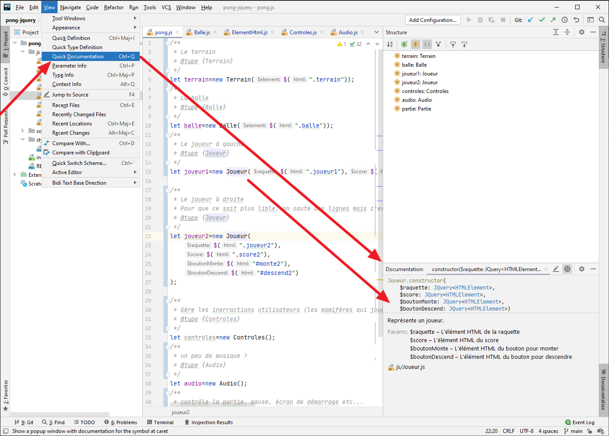
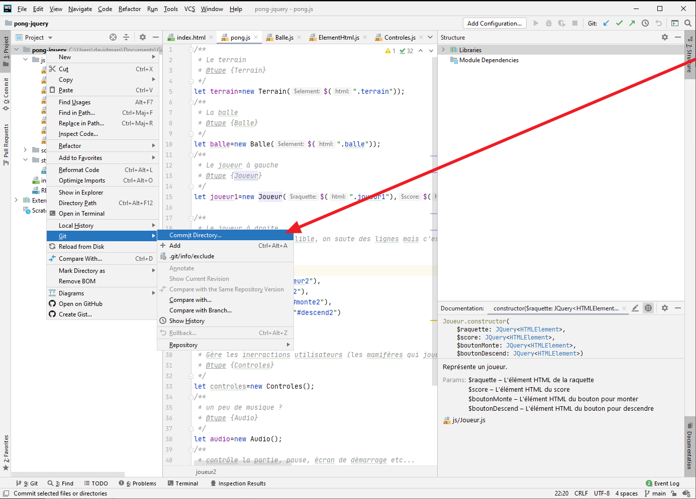
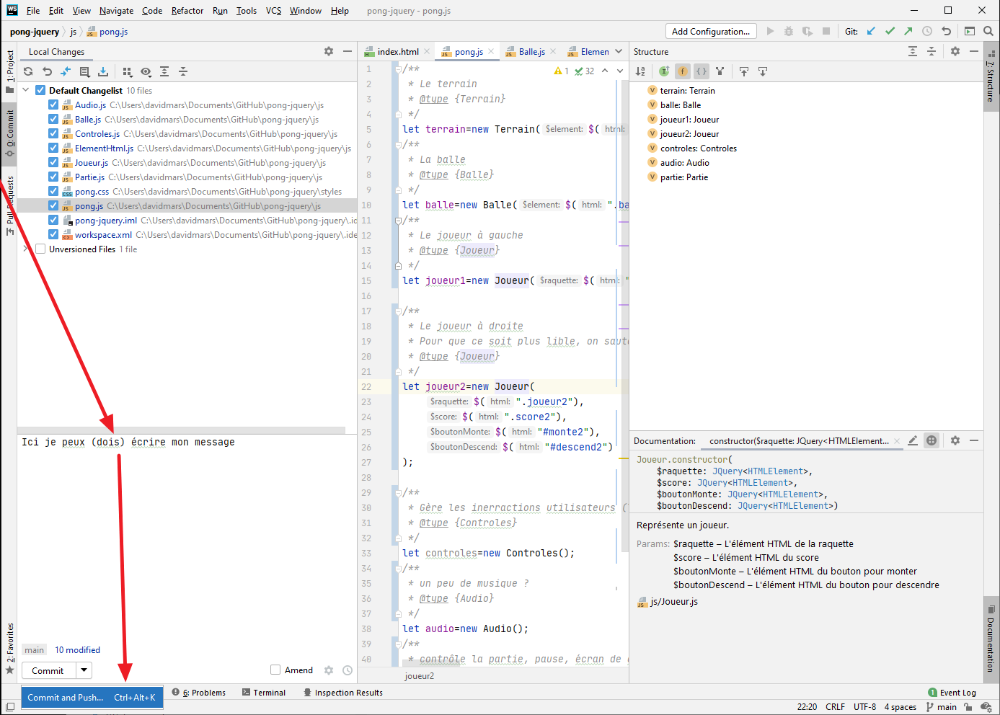
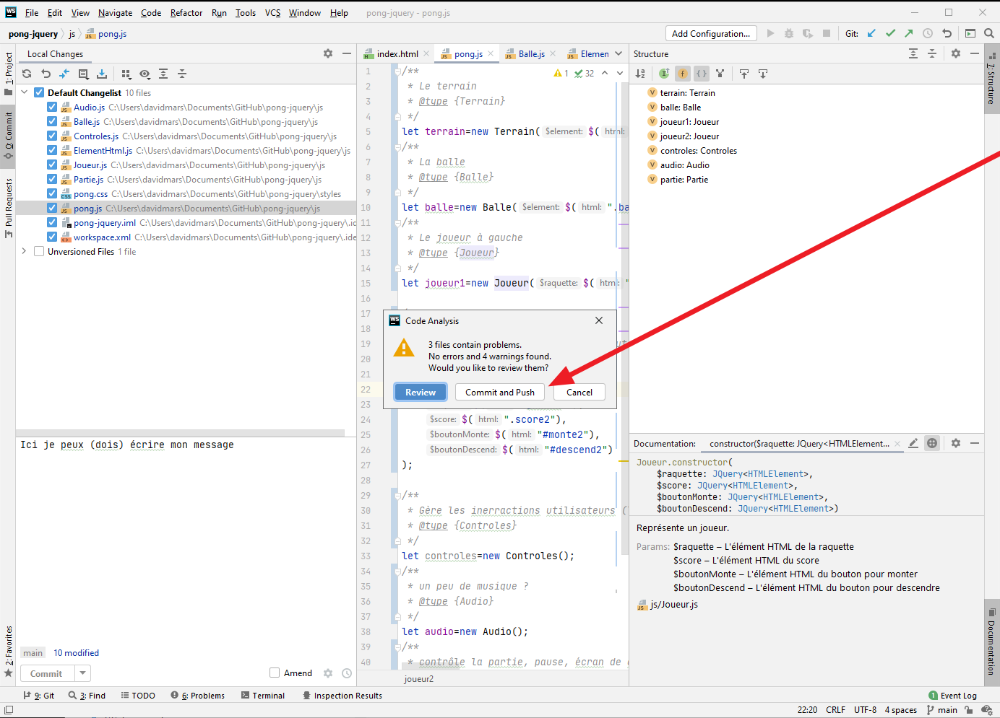
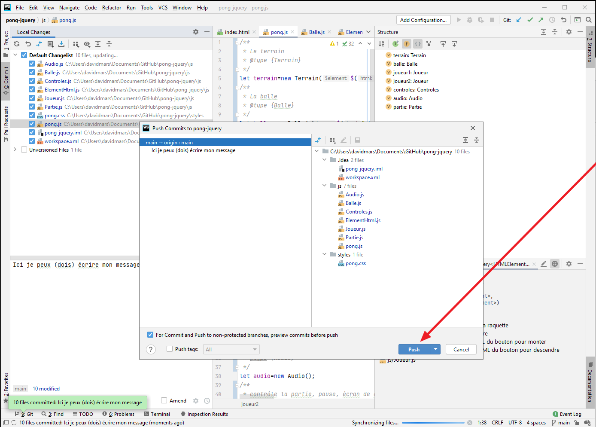
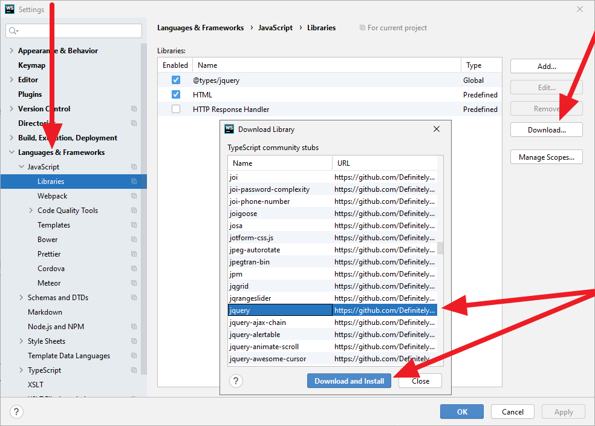
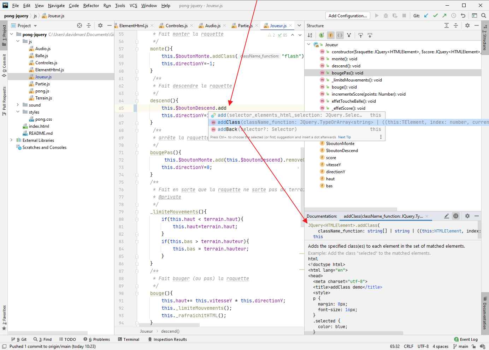
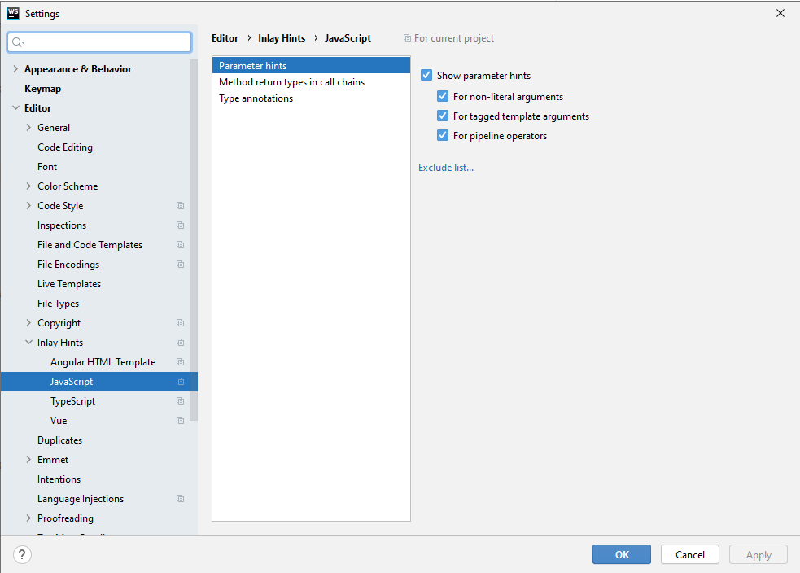
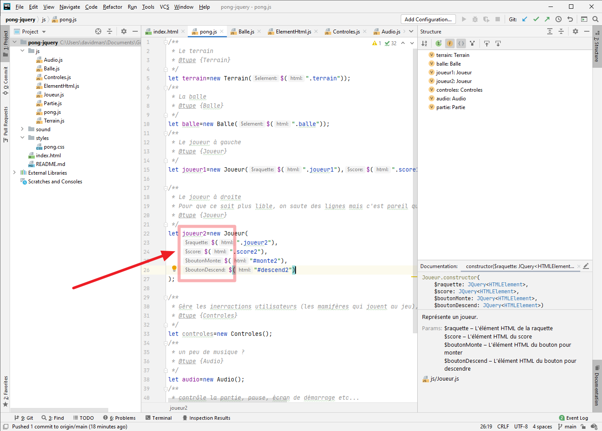

# Webstorm c'est quoi ?

C'est un logiciel pour éditer du code. A l'inverse de Visual Studio qui est très généraliste, Webstorm se focalise sur les langages WEB (Javascript, HTML, CSS + dérivés).

### JetBrain (l'éditeur du logiciel) et sa suite logicielle
WebStorm fait partie d'une famille de logiciels spécialisés particulièrement appréciés par l'écosystème du Jeu Vidéo. Je vous laisse regarder les références en bas de la page qui suit, vous verrez qu'on ne parle pas d'un éditeur de logiciel annodin. Oui oui le créateur d'Unity utilise leurs logiciels, mais aussi quelque petites sociétés comme Ubi, Nintendo, Epic...

https://www.jetbrains.com/fr-fr/gamedev/

#### Anecdote...
Jetbrain a récemment inventé un langage nommé [Kotlin](https://developer.android.com/kotlin?hl=fr). Ce langage est devenu le langage officel pour Android, rien que ça!

## Les avantages de Websorm par rapport à Visual Studio

Soyons clairs tout ce que permet Webstorm est possible avec Visual Studio. Pourquoi alors utiliser Webstorm?

Car l'essentiel des fonctionnalités *intelligentes* sont déjà intégrées dans WebStorm. Dans Visual Studio il faut installer et configurer beaucoup de pluggins et parfois passer par des lignes de commande pour que ça fonctionne.

#### On ne va pas se prendre trop la tête...

Avant de configurer votre éditeur, je vous conseille tout simplement de l'essayer. WebStorm n'est pas plus compliqué que VSCode, à mon avis il est même plus simple. Si l'éditeur vous plait alors prenez un peu de temps pour le configurer ou pour comprendre ce qu'il pourra vous apporter plus tard.

#### En vidéo...
Une série de vidéos (où vous ne comprendrez pas tout pour le moment) peut vous aider à comprendre l'étendue de ce sujet.
https://www.youtube.com/watch?v=tFRq_gfq7Gg&list=PLQ176FUIyIUYnLuYVKM6JhVd6ukPgzdW7&index=8

#### ...ou plus rapidement
Ce que va principalement vous apporter WebStorm (ou tout autre logiciel de la gamme JetBrain) :

- Un code beacoup plus propre
   - Si une variable n'est pas utilisée, il va vous le dire
   - Si une ligne peut être écrite plus simplement il va vous le proposer
   - Si une partie de votre code risque de ne pas fonctionner il va vous avertir
   - Si il manque des commentaires, il va vous proposer de les générer automatiquement
   - etc...
   
- Plus de facilité à écrire du code
   - Quand vous allez coder, l'éditeur va vous proposer des possibilités. On appelle ça l'**auto complétion** ou **type hint**. Une fois qu'on a goûté à ça on ne peut plus s'en passer!
   - Quand vous allez coder, l'éditeur va vous afficher de l'aide pratiquement tout le temps.
   - Vous pourrez voir où vos variables et fonctions sont utilisées.
   - Vous pourrez rennomer une variable partout où elle est utilisée en un clic.
   - etc...
 
 - La liste est très très loin d'être exhaustive
    - Vous pourrez git/gommit/pull/push plus facilement
    - Comparer des bouts de code
    - Bénéficier d'un historique très précis et revenir en arrière comme vous voulez
    - Générer des diagrammes de vos projets
    - Générer des audits de votre code
    - Optimiser votre code
    - Gérer des TODO list
    - Utiliser des frameworks comme Vue, React, Angular etc...
    - Utiliser des langages comme SaaS, Less, TypeScript, etc...
    - etc...
   

# Pour installer WebStorm
https://www.jetbrains.com/fr-fr/webstorm/download/#section=windows

Vous pouvez utiliser la version d'évaluation pendant 30 jours. La version payante n'est pas très chère mais on va voir avec l'école si vous ne pouvez pas avoir des licences éducation gratuites.

# Quelques tips pour profiter pleinement de WebStorm

## Afficher la documentation de votre code

Le fenêtre n'est pas activée par défaut

## GitHub directement depuis votre éditeur

Quand vous utiliserez GitHub pour la première fois dans votre éditeur, des fenêtres d'autorisation s'ouvriront pour connecter votre éditeur à votre compte GitHub. Je ne l'explique pas, laissez-vous guider.

Pour le reste, je ne rentre pas dans les détails, quelques screen shot seront plus parlants.

## Dire à votre éditeur que vous utilisez jQuery

Du coup votre éditeur comprendra jQuery et il vous proposera des trucs cools quand vous utiliserez du jQuery

## Afficher les paramètres de fonction

Tous les programmeurs n'aiment pas cette option, c'est à vous de voir.

Ce qui permettra d'afficher ceci...

